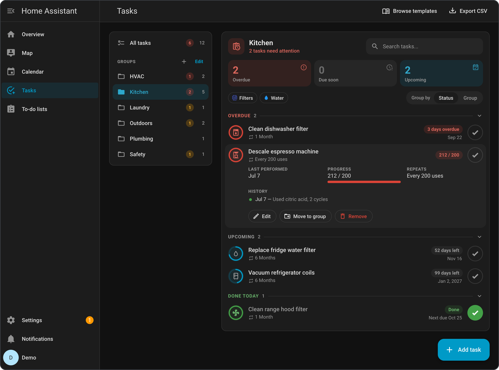
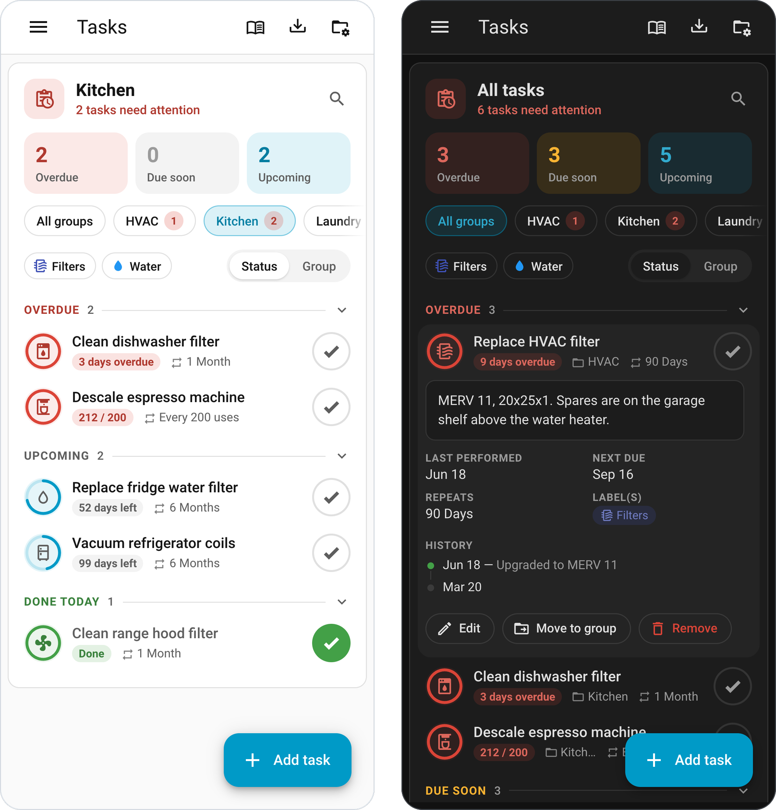
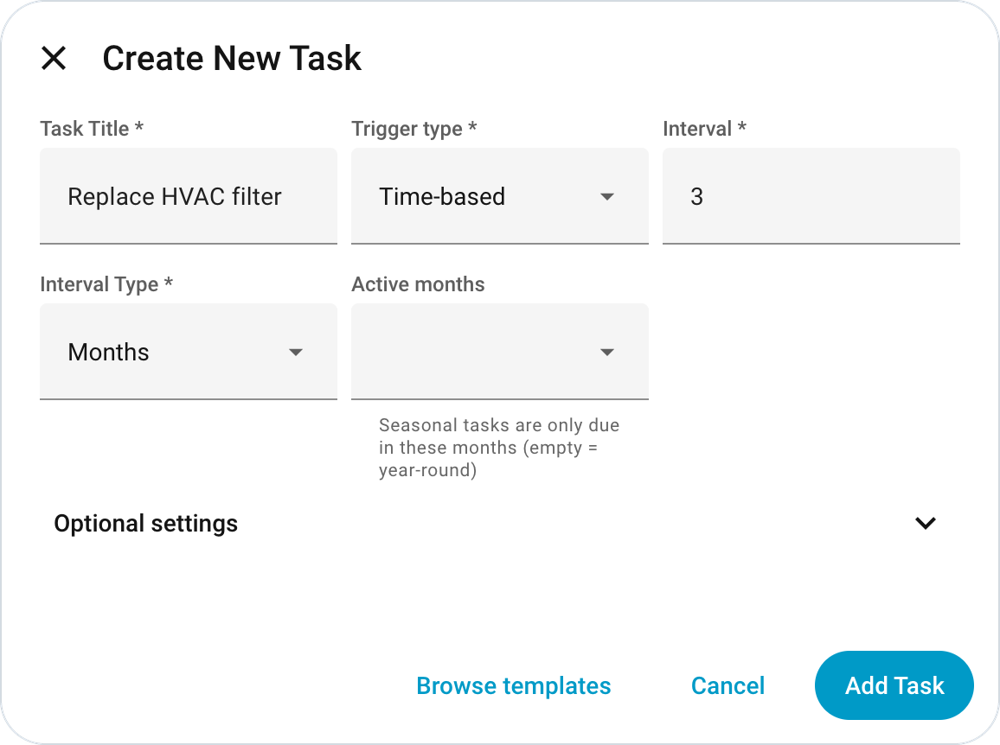
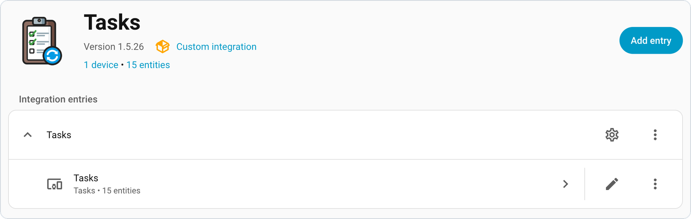
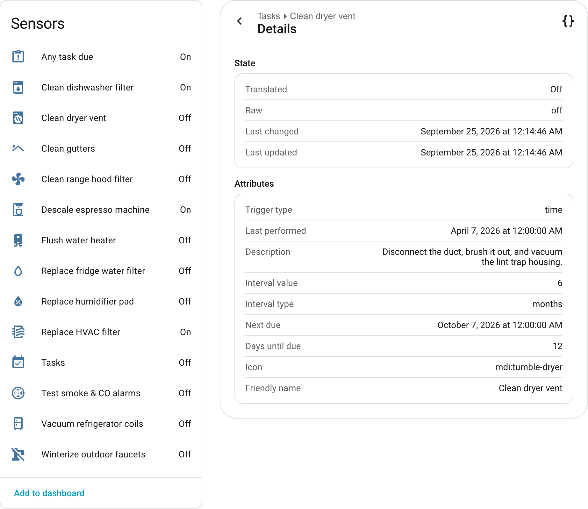

# Tasks for Home Assistant

[](https://github.com/kedube/ha-tasks/actions/workflows/ci.yml)
[](https://github.com/kedube/ha-tasks/releases)
[](https://hacs.xyz/)

Track recurring tasks in Home Assistant, from changing the furnace filter to testing the smoke alarms or descaling the espresso machine. See what needs doing at a glance and check tasks off from anywhere.


## Features

- **A sidebar panel for the whole list:** it shows what's overdue, due soon, and upcoming, with task groups, search, and label filters. It works on phones and in dark themes.
- **Four kinds of schedule:**
  - every so many days, weeks, months, or years
  - on fixed calendar dates
  - after a device has been used a set number of times
  - after a sensor has counted enough runtime

  Time-based tasks can also be limited to a season.
- **Works with the rest of Home Assistant:** every task is an entity that turns on when it's due. There's also an "any task due" sensor, a to-do list, and a calendar, so automations, dashboards, voice assistants, and the companion apps work without extra setup.
- **Check tasks off from anywhere:** the panel, the to-do list, a notification's **Mark complete** button, an NFC tag, or an automation. Each task keeps a history of completions, with optional notes.
- **Reminders for each task,** with an early warning, snooze, and a link to open (a manual, for example).
- **A quick start:** 90+ ready-made templates, plus import and export by spreadsheet (CSV).
- **Room for the whole household:** other users can view tasks and check them off, while only admins can change them.
- **Available in 8 languages.**

## Contents

- [Installation](#installation)
- [Coming from Home Maintenance](#coming-from-home-maintenance)
- [Using the panel](#using-the-panel)
- [Configuration](#configuration)
- [Dashboards](#dashboards)
- [Entities](#entities)
- [Services](#services)
- [Events](#events)
- [Automation examples](#automation-examples)
- [Troubleshooting](#troubleshooting)
- [Contributing](#contributing)
- [Credits](#credits)
- [License](#license)

## Installation

Tasks needs Home Assistant **2026.3.2** or newer.

### With HACS

1. In Home Assistant, open **HACS**.
2. Open the menu in the top-right corner (**⋮**) and choose **Custom repositories**.
3. Add `https://github.com/kedube/ha-tasks` with the type **Integration**.
4. Search HACS for **Tasks**, open it, and click **Download**.
5. Restart Home Assistant.
6. Go to **Settings → Devices & services → Add integration** and choose **Tasks**, or use this button:

   [](https://my.home-assistant.io/redirect/config_flow_start/?domain=tasks)

### Manually

1. Download `tasks.zip` from the [latest release](https://github.com/kedube/ha-tasks/releases/latest).
2. Extract it into `config/custom_components/tasks`.
3. Restart Home Assistant and add the integration as in step 6 above.

Once it's added, **Tasks** appears in the sidebar.

## Coming from Home Maintenance

Tasks was called *Home Maintenance* up to version 1.5.25 (domain `home_maintenance`). @TJPoorman's original integration still uses that name.

The domain changed, so Home Assistant treats Tasks as a new integration. Switching takes a few steps. Your tasks, groups, and completion history come across automatically.

1. **Delete the old entry.** Go to **Settings → Devices & services → Home Maintenance → ⋮ → Delete**. This frees the old entity IDs so Tasks can reuse them. Your saved tasks aren't touched.
2. **Remove the old files.** In HACS, remove *Home Maintenance*. For a manual install, delete `custom_components/home_maintenance` instead.
3. **Install Tasks** as described in [Installation](#installation). If you already use this repository in HACS, download it again.
4. **Restart and add Tasks.** On first setup, Tasks imports everything from the old storage file (the file stays in place). Then set your [options](#configuration) again.
5. **Update your automations, scripts, and dashboards** with the new names:

| Before | After | From the original Home Maintenance |
| --- | --- | :-: |
| `home_maintenance.reset_last_performed` (and the other services) | `tasks.reset_last_performed` | ✓ |
| `/home-maintenance` panel URL | `/tasks` | ✓ |
| `home_maintenance_task_completed` / `home_maintenance_task_due` events | `tasks_task_completed` / `tasks_task_due` | |
| `todo.home_maintenance`, `calendar.home_maintenance` | `todo.tasks`, `calendar.tasks` | |
| `custom:home-maintenance-add-task-card` | `custom:tasks-add-task-card` | |

Task entities keep their IDs (for example `binary_sensor.clean_gutters`) if you delete the old entry first. NFC tag assignments carry over with the tasks.

## Using the panel

Open **Tasks** from the sidebar:

- **Groups** are listed down the left, under **All tasks**. Each one shows how many tasks it has and how many need attention; click one to show only its tasks. **+** adds a group, and **Edit** renames or deletes them.
- **Counts:** the header says how many tasks need attention. The **Overdue**, **Due soon**, and **Upcoming** tiles count each kind of task; click a tile to show only those tasks. *Due soon* means within 14 days unless you [change it](#configuration).
- **Status / Group** switches the list between sections by urgency and sections by group. The panel remembers your choice.
- **Each task** shows a ring that fills as it comes due, and a label with its due date or progress. The **✓** button marks it done (you can add a note first). Tasks finished today move to **Done today**.
- **Click a task** to see its description, dates, labels, area, and recent history, with **Edit**, **Move to group**, and **Remove**.



On a phone or in a narrow window, the groups become a row of chips above the list, and **Manage groups** moves to the toolbar. Changes made elsewhere show up right away, without a refresh. That includes an NFC tag scan, an automation, or a sensor ticking over.



### Adding tasks

Click **Add task** in the bottom corner. The main fields come first: the title, the trigger type, and how often. Everything else is under **Optional settings**. To start from a ready-made task, choose **Browse templates** instead.



### Trigger types

A task's trigger type decides when it comes due:

| Trigger | Due when… | Checking it off… |
| --- | --- | --- |
| **Time-based** (default) | a set time (days, weeks, months, or years) has passed since you last did it | resets the last-performed date |
| **Fixed date** | a date on the calendar arrives, such as every October 1 | moves on to the next date |
| **Count-based** | a device you pick has turned on a set number of times | resets the count to zero |
| **Runtime-based** | a sensor you pick has gone up by a set amount, such as 50 hours of running time | starts counting again from the sensor's current value |

- **Fixed-date** tasks suit seasonal jobs, such as winterizing the sprinklers every October 1. Pick an **Anchor date** and how often it repeats:
  - The date stays October 1, whenever you actually did the job last.
  - A missed date stays due until you check the task off, and then the next date takes over. Checking it off early doesn't skip the next date.
  - If you leave **Last performed** blank on a new task, an anchor date that's already passed makes the task due right away.
- **Time-based** tasks can be **seasonal**: pick the months they're active, such as April to October for lawn care.
  - A due date that falls out of season moves to the start of the next season.
  - The task is never flagged as due outside its months.
- **Count-based** tasks count each time a device turns on, such as "descale the coffee machine every 60 brews". The panel shows progress as `current / target`, and the count can also be changed with a [service call](#services).
- **Runtime-based** tasks watch a number that keeps growing, such as hours of runtime or liters used. If the sensor resets to a lower value, the task starts counting again from there.

### Task fields

Beyond the title and schedule, a task can have:

- **Last performed:** defaults to today.
- **Active months:** makes a time-based task seasonal.
- **Icon:** any Material Design icon.
- **Labels and area:** Home Assistant labels and an area for the task's entity.
- **Description:** free-form notes.
- **Group:** pick one, or type a new name to create it.
- **NFC tag:** scanning it checks the task off.
- **Notifications:** see [Notifications](#notifications).

### Task groups

Groups sort tasks by room or system, such as *Kitchen*, *HVAC*, and *Outdoors*. Tasks without a group appear under *Ungrouped*.

- **Create, rename, or delete** groups in the group list, or under **Manage groups** on a phone.
  - Renaming a group moves its tasks along with it.
  - Deleting a group moves its tasks to *Ungrouped*. The tasks themselves are never deleted.
- **Assign** a task to a group with the **Group** field when you add or edit it, or with **Move to group** in the task's details.

### Search and label filters

- **Search** matches words in task titles and descriptions.
- **Label chips** appear for each label that's on at least one task. Selecting chips shows tasks with *any* of the selected labels. **Clear filters** resets them.

The count tiles only count the tasks that match your filters.

### Notifications

Turn on notifications in the **Notifications** section of a task's settings:

- **Notify service:** any `notify.*` service, such as `notify.mobile_app_your_phone` (default `notify.notify`).
- **Notify when:** when the task is due, overdue, or both.
- **Days before due:** an early reminder for time-based and fixed-date tasks.
- **Time of day:** when the reminder is sent (default 09:00).
- **Open URL:** a link for the notification's **Open** button, such as the appliance manual.

A task sends at most one notification of each kind per day. On the Home Assistant companion apps, notifications have **Mark complete** and **Snooze** buttons. Snooze silences the task for a day; use [`tasks.snooze_task`](#taskssnooze_task) for longer. Checking a task off clears its notification on the phone. To try a task's notification right away, use **Send test notification** when editing the task.

### Templates and CSV import/export

- **Browse templates** opens a searchable library of 90+ common tasks, each with a sensible schedule and icon. The areas covered are HVAC, plumbing, electrical, appliances, interior, exterior, yard, safety, and vehicles. Picking one opens the add-task form filled in, so you can adjust it before saving. Template text is in English; category names follow your language.
- **Import from CSV** (in the template dialog) adds many tasks at once from a spreadsheet saved as `.csv`. The file needs a header row with these columns:
  - `title` (required)
  - `description`
  - `interval_value` (default 30)
  - `interval_type`: `days`, `weeks`, `months`, or `years` (default `days`)
  - `last_performed`: `YYYY-MM-DD` (default today)
  - `icon`
  - `group_id`

  You'll see a preview before anything is added. Lines with problems are skipped and listed.
- **Export CSV** saves all tasks as `tasks.csv` with the same columns, ready to import again. Count- and runtime-based schedules aren't in the CSV format, so those tasks come back as time-based.

```csv
title,description,interval_value,interval_type,last_performed,icon,group_id
Replace HVAC filter,MERV 13,90,days,2026-01-15,mdi:air-filter,HVAC
Clean gutters,Front and back,6,months,,mdi:home-roof,Exterior
```

### NFC tags

Give a task an NFC tag, and scanning the tag checks the task off. One tag can check off several tasks at once, such as a "furnace room" tag that covers every filter task in that room.

## Configuration

| Option | Default | What it does |
| --- | --- | --- |
| **Admin only** | On | When on, only admins see the panel. When off, other users can open it to view tasks and check them off. Only admins can add, edit, or remove tasks and manage groups either way. |
| **Sidebar title** | *Tasks* | The panel's name in the sidebar. |
| **"Due soon" window** | 14 days | How far ahead a task counts as *Due soon* in the panel. `0` means only tasks due today. |
| **Completion-history entries kept per task** | 50 | How many past completions each task keeps. `0` keeps them all. |

Setup asks for the first two. To change any option later, go to **Settings → Devices & services → Tasks** and click the gear (**Configure**). Changes apply straight away, without a restart. Only one Tasks entry can be added.

[](https://my.home-assistant.io/redirect/integration/?domain=tasks)



## Dashboards

The panel is where tasks are managed. To see them on a dashboard, use Home Assistant's own cards with the Tasks entities:

- **[To-do list card](https://www.home-assistant.io/dashboards/todo-list/)** on `todo.tasks`: lists what's due, and checking an item off completes the task. Add `hide_completed: true` to show only due tasks.
- **Tile** or **entities** card on a task's `binary_sensor`, or on [`binary_sensor.any_task_due`](#any-task-due) for a single "does anything need doing?" light.
- **Calendar card** on [`calendar.tasks`](#calendar) for upcoming due dates.

Tasks also includes an **Add Task** card: the panel's full add-task form on any dashboard. Only admins can add tasks, so other users see a short note instead. The card is set up automatically and appears in the card picker, or you can add it in YAML:

```yaml
type: custom:tasks-add-task-card
title: Add Task   # optional header; leave empty for none
```

For a complete view that combines these cards, see the [example dashboard](docs/example-dashboard.md).

## Entities

Every task is a `binary_sensor` that turns **on** while the task is due. All of them are grouped under one *Tasks* device.



A task's attributes depend on its trigger type:

| Attribute | Time | Date | Count | Runtime |
| --- | :-: | :-: | :-: | :-: |
| `trigger_type`, `last_performed`, `description` | ✓ | ✓ | ✓ | ✓ |
| `tag_id` (when an NFC tag is set) | ✓ | ✓ | ✓ | ✓ |
| `interval_value`, `interval_type`, `next_due`, `days_until_due` | ✓ | ✓ | | |
| `anchor_date` | | ✓ | | |
| `active_months` (when a season is set) | ✓ | | | |
| `current_count`, `count_threshold`, `count_entity_id` | | | ✓ | |
| `runtime_entity_id`, `runtime_threshold`, `runtime_baseline`, `runtime_current`, `runtime_delta` | | | | ✓ |

`days_until_due` counts calendar days until the task is due: `0` means today and negative numbers mean overdue. That keeps automation conditions simple, for example `{{ state_attr('binary_sensor.clean_gutters', 'days_until_due') <= 3 }}`.

### Any task due

`binary_sensor.any_task_due` is **on** while *any* task is due. Its attributes are `due_count`, `due_tasks` (the due tasks' titles), and `task_count`.

### To-do list

`todo.tasks` lists every task as a Home Assistant to-do item:

- Due tasks are open items and the rest show as done; dated tasks carry their next due date.
- The to-do list card, the companion apps' to-do widgets, and voice assistants ("what's on my tasks list?") work with it out of the box.
- Checking an item off completes the task, and renaming an item or editing its description updates the task.
- Tasks can't be added, deleted, or reopened from the to-do list; use the panel for that.

### Calendar

`calendar.tasks` shows every time-based and fixed-date task as an all-day event, a year ahead. That's the next due date plus the expected repeats after it, assuming each is done on time.

- Use it in the Calendar dashboard, calendar cards, [calendar-trigger automations](https://www.home-assistant.io/docs/automation/trigger/#calendar-trigger), and `calendar.get_events`.
- Count- and runtime-based tasks don't have due dates, so they don't appear.
- Overdue tasks stay on their original due date.

### Completion history

Each task keeps a history of completions, however they happen: the panel, the to-do list, a notification, a tag scan, or a service call. Each entry records the date, the time, and an optional note.

- The panel shows recent entries in a task's details.
- The edit dialog shows the full history.
- Each task keeps its 50 most recent entries unless you [change the limit](#configuration).

## Services

### `tasks.reset_last_performed`

Marks a task done. You can backdate it with `performed_date` and add a `note` to its [history](#completion-history).

```yaml
action: tasks.reset_last_performed
data:
  entity_id: binary_sensor.clean_gutters
  performed_date: "2026-06-19"  # optional; defaults to today
  note: "Hired the crew from Main St"  # optional
```

### `tasks.increment_count`

Adds one use to a count-based task. This is useful when what you want to count isn't a single device turning on.

```yaml
action: tasks.increment_count
data:
  entity_id: binary_sensor.descale_coffee_machine
```

### `tasks.reset_count`

Resets a count-based task to zero **without** marking it done.

```yaml
action: tasks.reset_count
data:
  entity_id: binary_sensor.descale_coffee_machine
```

### `tasks.snooze_task`

Silences a task's [notifications](#notifications) for a number of days (default 1) without completing it.

```yaml
action: tasks.snooze_task
data:
  entity_id: binary_sensor.change_hvac_filter
  days: 3  # optional; defaults to 1
```

### `tasks.send_task_notification`

Sends the task's notification right away, whether or not it's due or snoozed. Handy for testing.

```yaml
action: tasks.send_task_notification
data:
  entity_id: binary_sensor.change_hvac_filter
```

### `tasks.create_task`

Adds a task from an automation, script, or voice assistant (admins only).

- `title` and `interval_value` are required. `interval_type` defaults to `days` and `last_performed` to today.
- Every other task field works too, with the same checks as the panel.
- With `response_variable`, the call returns the new task's id.

```yaml
action: tasks.create_task
data:
  title: Replace HVAC filter
  interval_value: 90
  description: MERV 13
  icon: mdi:air-filter
  group_id: HVAC
response_variable: new_task  # optional; new_task.task_id holds the id
```

### `tasks.mark_overdue`

Makes a task due right now, for testing automations and notifications without waiting (admins only). The call fails, rather than doing nothing, if the task can't be due at the moment. That happens when:

- a fixed-date task hasn't reached its first date yet
- a [seasonal](#trigger-types) task is out of season
- a runtime task's sensor is unavailable

```yaml
action: tasks.mark_overdue
data:
  entity_id: binary_sensor.change_hvac_filter
```

## Events

- **`tasks_task_completed`** fires every time a task is completed, however it's done. Data: `task_id`, `entity_id`, `title`, `trigger_type`, `group_id`, `performed` (date), `note`.
- **`tasks_task_due`** fires when a task comes due while Home Assistant is running. A task that's already due at startup doesn't fire it again. Data: `task_id`, `entity_id`, `title`, `trigger_type`, `group_id`.

## Automation examples

Each task's [notifications](#notifications) cover the everyday case. For anything more, use the entities and events.

**Log completed tasks to the logbook:**

```yaml
automation:
  - alias: "Tasks: log completions"
    triggers:
      - trigger: event
        event_type: tasks_task_completed
    actions:
      - action: logbook.log
        data:
          name: "{{ trigger.event.data.title }}"
          message: "completed{{ ' — ' + trigger.event.data.note if trigger.event.data.note }}"
```

**A Saturday-morning digest of everything due:**

```yaml
automation:
  - alias: "Tasks: weekly digest"
    triggers:
      - trigger: time
        at: "09:00:00"
    conditions:
      - condition: time
        weekday: sat
      - condition: state
        entity_id: binary_sensor.any_task_due
        state: "on"
    actions:
      - action: notify.mobile_app_your_phone
        data:
          title: "{{ state_attr('binary_sensor.any_task_due', 'due_count') }} tasks due"
          message: "{{ state_attr('binary_sensor.any_task_due', 'due_tasks') | join(', ') }}"
```

**React to one task coming due:**

```yaml
automation:
  - alias: "Tasks: HVAC filter due"
    triggers:
      - trigger: state
        entity_id: binary_sensor.change_hvac_filter
        to: "on"
    actions:
      - action: notify.mobile_app_your_phone
        data:
          title: "Task due"
          message: "Time to change the HVAC filter."
```

## Troubleshooting

**The panel looks out of date after an upgrade.** Reload the page after Home Assistant restarts; you don't need to clear the cache. If it still looks old, check **Settings → Dashboards → ⋮ → Resources**. Remove any `/tasks_static/…` or `/home_maintenance_static/…` entries added by hand.

**A dashboard shows "Custom element doesn't exist: home-maintenance-…".** The card was made before the rename:
- Change the Add Task card to `custom:tasks-add-task-card`.
- The *Home Maintenance Todo* card no longer exists. Use the [panel](#using-the-panel), or the built-in to-do list card on `todo.tasks`.

**A field is missing or a button does nothing.** Try a private browser window first, to rule out old files in the browser's cache. If it still happens, [open an issue](https://github.com/kedube/ha-tasks/issues) with your Home Assistant version and the browser console's output (press F12 to open it).

**Other users can't see the panel.** Turn off **Admin only** under [Configuration](#configuration). They'll be able to view tasks and check them off, but not change them.

**A count or runtime task stopped counting, or notifications stopped.** Check **Settings → System → Repairs**. Tasks reports a problem there when a device or notify service a task uses has gone, and clears it once that's fixed.

**Reporting a bug?** Attach the diagnostics file from **Settings → Devices & services → Tasks → ⋮ → Download diagnostics**. Descriptions, notes, links, and tag IDs are removed from it automatically.

Found a bug or have an idea? [Open an issue](https://github.com/kedube/ha-tasks/issues).

## Contributing

Contributions are welcome. [CONTRIBUTING.md](CONTRIBUTING.md) covers the development setup, tests, and how releases work. [docs/architecture.md](docs/architecture.md) explains how the code fits together.

Tasks stays close to the original Home Maintenance goal: recurring tasks without a pile of helpers and automations. It aims to work with Home Assistant's own dashboards, automations, and alerts rather than replace them. Feature requests that repeat what Home Assistant already does may be declined.

## Credits

Tasks is built on **[Home Maintenance](https://github.com/TJPoorman/home_maintenance)** by **[@TJPoorman](https://github.com/TJPoorman)**. This project began in 2026 as a fork of it, and its foundation is still that original design:

- each recurring task as its own Home Assistant entity
- a sidebar panel for managing them
- checking tasks off with a service call or an NFC tag
- a small scope that works alongside Home Assistant rather than duplicating it

Many thanks to @TJPoorman for creating Home Maintenance and sharing it under the MIT license.

## License

[MIT](LICENSE)
